# Portfolio de Yeison Fajardo

[](https://yeisonfjrd.netlify.app/)

## Diagrama de Arquitectura del Portafolio (Estilizado)

```mermaid
graph LR
    subgraph Raíz del Proyecto
        direction TB
        rootFolder("Portfolio.yeison")
        style rootFolder fill:#f0f0f0,stroke:#333,stroke-width:2px

        subgraph Carpeta .astro
            direction TB
            astroFolder(".astro")
            style astroFolder fill:#e0e0e0,stroke:#333,stroke-width:1px
            settingsJsonAstro(".astro/settings.json")
            style settingsJsonAstro fill:#f9f,stroke:#333,stroke-width:1px
            astroFolder --> settingsJsonAstro
        end

        subgraph Carpeta .vscode
            direction TB
            vscodeFolder(".vscode")
            style vscodeFolder fill:#e0e0e0,stroke:#333,stroke-width:1px
            extensionsJsonVSCode(".vscode/extensions.json")
            style extensionsJsonVSCode fill:#f9f,stroke:#333,stroke-width:1px
            launchJsonVSCode(".vscode/launch.json")
            style launchJsonVSCode fill:#f9f,stroke:#333,stroke-width:1px
            settingsJsonVSCode(".vscode/settings.json")
            style settingsJsonVSCode fill:#f9f,stroke:#333,stroke-width:1px
            vscodeFolder --> extensionsJsonVSCode
            vscodeFolder --> launchJsonVSCode
            vscodeFolder --> settingsJsonVSCode
        end

        subgraph Carpeta dist
            direction TB
            distFolder("dist")
            style distFolder fill:#e0e0e0,stroke:#333,stroke-width:1px
        end

        subgraph Carpeta src
            direction TB
            srcFolder("src")
            style srcFolder fill:#c0e0c0,stroke:#333,stroke-width:1px
            subgraph Carpeta assets
                direction TB
                assetsFolder("assets")
                style assetsFolder fill:#d0f0d0,stroke:#333,stroke-width:1px
            end
            srcFolder --> assetsFolder
        end

        subgraph Carpeta public
            direction TB
            publicFolder("public")
            style publicFolder fill:#c0e0c0,stroke:#333,stroke-width:1px
        end

        subgraph Carpeta node_modules
            direction TB
            nodeModulesFolder("node_modules")
            style nodeModulesFolder fill:#e0e0e0,stroke:#333,stroke-width:1px
        end

        gitignoreFile(".gitignore")
        style gitignoreFile fill:#f9f,stroke:#333,stroke-width:1px
        astroConfigFile("astro.config.mjs")
        style astroConfigFile fill:#f9f,stroke:#333,stroke-width:1px
        packageJsonFile("package.json")
        style packageJsonFile fill:#f9f,stroke:#333,stroke-width:1px
        supabaseTsFile("supabase.ts")
        style supabaseTsFile fill:#f9f,stroke:#333,stroke-width:1px
        tailwindConfigFile("tailwind.config.mjs")
        style tailwindConfigFile fill:#f9f,stroke:#333,stroke-width:1px
        tsConfigJsonFile("tsconfig.json")
        style tsConfigJsonFile fill:#f9f,stroke:#333,stroke-width:1px
        pnpmLockFile("pnpm-lock.yaml")
        style pnpmLockFile fill:#f9f,stroke:#333,stroke-width:1px

        rootFolder --> astroFolder
        rootFolder --> vscodeFolder
        rootFolder --> distFolder
        rootFolder --> srcFolder
        rootFolder --> publicFolder
        rootFolder --> nodeModulesFolder
        rootFolder --> gitignoreFile
        rootFolder --> astroConfigFile
        rootFolder --> packageJsonFile
        rootFolder --> supabaseTsFile
        rootFolder --> tailwindConfigFile
        rootFolder --> tsConfigJsonFile
        rootFolder --> pnpmLockFile
    end
```




## Sobre Mí

Soy un desarrollador web en formación, estudiando Desarrollo de Software en la Universidad Provincial de Ezeiza. He completado cursos avanzados en React y JavaScript, construyendo aplicaciones web interactivas y dinámicas. Mis habilidades incluyen HTML, CSS, JavaScript, React y gestión de bases de datos con MySQL.

🔗 [Ver portafolio](https://portfolio-yeison.vercel.app/)

## Tecnologías Usadas

- **Framework:** Astro
- **Estilos:** Tailwind CSS
- **Base de Datos:** Supabase
- **Lenguaje:** TypeScript
- **Gestión de Dependencias:** pnpm

## Instalación y Uso

Para ejecutar este proyecto en tu máquina local:

```bash
pnpm install  # Instalar dependencias
pnpm dev      # Ejecutar en modo desarrollo
```

## Contacto

📌 [LinkedIn](https://www.linkedin.com/in/yeison-fajardo)
📌 [GitHub](https://github.com/yeisonfjrd)
